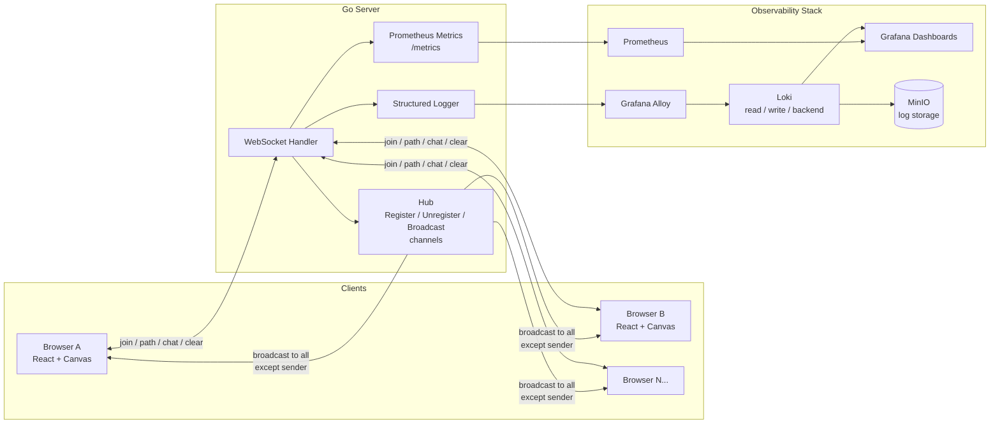

<div align="center">


<br />

[](https://go.dev/)
[](https://react.dev/)
[](https://www.typescriptlang.org/)
[](https://github.com/gorilla/websocket)
[](https://www.docker.com/)
[](https://grafana.com/)
[](https://prometheus.io/)

</div>

---

## Overview

**Exalidraw** is a real-time, multiplayer collaborative whiteboard. Multiple users join a shared canvas, pick a name and an emoji avatar, and draw together with their strokes appearing on every connected screen within milliseconds.

What sets this project apart from a typical "skribbl.io clone" is what sits underneath it: a hand-built Go WebSocket hub designed around channel-based concurrency, a client-side stroke pipeline tuned for low-latency feedback and low network overhead, and a complete production-grade observability stack (Prometheus, Grafana, Loki, and Grafana Alloy) running alongside the application itself, fully containerized and deployable with a single script.

This README walks through the product, the architecture, and the engineering decisions that shaped it.

---

## ✨ Features

| | |
|---|---|
| 🎨 **Live shared canvas** | Every stroke, by every user, rendered instantly across all connected clients |
| 🙂 **Identity in one click** | Pick a name and an emoji avatar from a 130+ emoji picker, no signup required |
| 👥 **Live presence** | Real-time active player list with join/leave toast notifications |
| 💬 **In-room chat** | A dedicated chat panel synced over the same WebSocket connection |
| 🖌 **Drawing tools** | 7-color palette, 4 stroke widths, clear, copy to clipboard, and download as PNG |
| 🔁 **Resilient connections** | Automatic reconnection with exponential backoff and live status toasts |
| 📊 **Built-in observability** | Every connection, draw event, and chat message is tracked via Prometheus and visualized in Grafana |
| 🐳 **One-command deploy** | `setup.sh` brings up the full app and observability stack via Docker Compose |
| 🤖 **Load-tested** | A Puppeteer script simulates multiple concurrent drawers to stress-test the broadcast pipeline |

---

## 🏗 System Architecture



The frontend never talks to the observability stack directly. The Go server is the single source of truth: it owns connection state, fans out drawing and chat events, and emits both metrics and structured logs as a side effect of normal operation. Nothing in the observability layer is bolted on after the fact, it is wired into the same request path.

---

## 🧠 Architectural Highlights

### 1. The Hub: concurrency without a mutex

The server's connection state lives entirely inside a single `Hub` struct, owned by one goroutine and mutated only through three channels: `Register`, `Unregister`, and `Broadcast`. Every connect, disconnect, and broadcast is funneled through a single `select` loop.

```go
for {
    select {
    case newConnection := <-h.Register:
        h.Players[newConnection.Conn] = newConnection
    case disconnectedConnection := <-h.Unregister:
        delete(h.Players, disconnectedConnection.Conn)
    case message := <-h.Broadcast:
        for conn, player := range h.Players {
            conn.WriteMessage(websocket.TextMessage, message)
        }
    }
}
```

This is the classic Go answer to "how do I share state across hundreds of goroutines safely": don't share it, send messages to the goroutine that owns it. No locks, no race conditions, and the active player count, broadcast queue, and connection map all stay consistent by construction.

### 2. Self-echo suppression in the broadcast loop

When a client draws, it renders its own stroke immediately and optimistically, then sends the path to the server. If the server echoed that same event straight back, the client would either redraw a stroke it already has or have to diff incoming events against its own history.

Instead, the Hub inspects the message type and the originating player's ID before fanning a message out, and skips the sender entirely for `draw`, `path`, `player_join`, and `player_leave` events:

```go
if messageData["type"] == "draw" || messageData["type"] == "path" ||
   messageData["type"] == "player_join" || messageData["type"] == "player_leave" {
    if playerId == player.Id {
        continue // don't echo back to the sender
    }
}
```

The result: every client sees its own input instantly (zero network round trip) and everyone else's input arrives over the wire, with no redundant traffic and no client-side deduplication logic.

### 3. Adaptive stroke sync: buffer, throttle, flush

Sending a WebSocket message on every `mousemove` would flood the network and the Hub under fast scribbling. Exalidraw instead treats each stroke as a small pipeline:

- Every point is drawn to the local canvas **immediately**, so the drawing feels instant regardless of network conditions.
- Points are pushed into an in-memory buffer and sent as a batched `path` message via a `lodash.throttle` wrapper firing at most every 150ms.
- After each send, the buffer is reset to just its last point, so the next batch starts exactly where the previous one ended, no gaps in the line.
- On `mouseup`, the throttled sender is **flushed** immediately, guaranteeing the final segment of a stroke is never dropped.

This turns potentially hundreds of `mousemove` events per stroke into a handful of WebSocket messages, while keeping the line continuous for every other connected client.

### 4. Resilient by default: exponential backoff reconnection

The WebSocket client wraps connection loss in an automatic recovery loop: up to 5 reconnect attempts, with delay doubling each time (1s, 2s, 4s, 8s, 16s), surfaced to the user via toast notifications at every stage. A clean disconnect (tab close, intentional logout) is distinguished from an unexpected drop, so reconnection only kicks in when it should.

### 5. Observability as a first-class citizen

Rather than treating monitoring as an afterthought, Exalidraw ships with its own dedicated observability stack, deployed as a second Docker Compose project alongside the app:

- **Prometheus** scrapes a `/metrics` endpoint exposing custom counters and gauges: active connections, players joined/left, draw events, path events, chat messages, total points drawn, hub channel sizes, and HTTP request latency histograms, all broken down by type and endpoint.
- **Grafana** ships with a pre-provisioned dashboard (`polydraw-dashboard.json`) visualizing every metric above out of the box.
- **Loki**, split into dedicated **read**, **write**, and **backend** components behind an **nginx gateway**, ingests structured application logs.
- **Grafana Alloy** acts as the log shipping pipeline from the application into Loki.
- **MinIO** provides S3-compatible object storage as Loki's persistence layer.

Every WebSocket message, HTTP request, and hub operation is instrumented through a single `InstrumentedHandler` wrapper, so adding a new endpoint automatically gets latency and status-code tracking for free.

### 6. Two networks, one command

The application and the observability stack run as two separate Docker Compose projects on two separate networks (`Exalidraw` and `loki`), so the drawing app can be deployed, scaled, or torn down independently of its monitoring stack. `setup.sh` and `terminate.sh` orchestrate both with a single call, bringing up 11 containers in total.

---

## 🛠 Tech Stack

### Frontend

| Technology | Purpose |
|---|---|
| React 19 + TypeScript | Component architecture and type safety |
| Vite 7 | Build tooling and dev server |
| Tailwind CSS v4 | Styling |
| Zustand | Client state (player identity, active players, chat messages) |
| React Router 7 | Routing between login and game views |
| Sonner | Toast notifications for connection and presence events |
| Lodash | Throttled stroke broadcasting |
| Puppeteer | Simulated multi-client drawing for load testing |

### Backend

| Technology | Purpose |
|---|---|
| Go 1.24 | Application server |
| Gorilla WebSocket | WebSocket protocol handling |
| Prometheus client_golang | Custom application metrics |
| Custom structured logger | Dual file + stdout logging |

### Observability & Infrastructure

| Technology | Purpose |
|---|---|
| Prometheus | Metrics collection |
| Grafana | Dashboards and visualization |
| Loki (read/write/backend) | Log aggregation |
| Grafana Alloy | Log shipping pipeline |
| MinIO | Object storage backend for Loki |
| Nginx | Static client serving and Loki gateway |
| Docker & Docker Compose | Containerization and orchestration |

---

## 📁 Project Structure

```
Exalidraw/
├── client/                       # React + TypeScript frontend
│   ├── src/
│   │   ├── components/           # Toolbar, ChatPanel, PlayerList, etc.
│   │   ├── hooks/                 # useCanvas, usePlayerJoin
│   │   ├── pages/                  # LoginPage, GamePage
│   │   ├── service/                # websocket.ts (connection + reconnection)
│   │   ├── stores/                  # Zustand stores
│   │   └── types/                    # Shared message/event types
│   ├── scripts/                  # Puppeteer load-test simulation
│   └── Dockerfile
│
├── server/                       # Go backend
│   ├── internal/                 # Hub, logger, Prometheus metrics, instrumentation
│   ├── ws/                        # WebSocket handler and message routing
│   ├── grafana/dashboards/       # Pre-provisioned Grafana dashboard
│   ├── loki-config.yaml
│   ├── alloy-local-config.yaml
│   ├── prometheus.yml
│   ├── docker-compose.yaml       # Observability stack
│   └── main.go
│
├── docker-compose.yml            # Application stack
├── setup.sh                       # Brings up app + observability stack
└── terminate.sh                   # Tears both down
```

---

## 🚀 Getting Started

### Prerequisites

- Docker and Docker Compose
- (For local development without containers) Go 1.24+ and Node.js 18+

### Run everything with one command

```bash
git clone https://github.com/ahmadali507/Exalidraw.git
cd Exalidraw
./setup.sh
```

This brings up the full application stack and the observability stack together. To stop everything:

```bash
./terminate.sh
```

### Ports

| Port | Service |
|---|---|
| `6969` | Client (served via Nginx) |
| `8080` | Go server: HTTP, WebSocket (`/ws`), metrics (`/metrics`), players (`/players`) |
| `3000` | Grafana dashboard |
| `3100` | Loki gateway |
| `9090` | Prometheus |
| `12345` | Grafana Alloy |

---

## 📊 Observability Dashboard

Once running, open Grafana at `http://localhost:3000` (anonymous access enabled) to see the pre-loaded dashboard tracking active players, WebSocket connections, draw/path/chat throughput, total points drawn, and HTTP latency, sourced directly from the Prometheus metrics exposed by the Go server.

---

## 🗺 Roadmap

- [ ] Shape tools (rectangles, circles, lines) alongside freehand drawing
- [ ] Persistent rooms with shareable links
- [ ] Undo/redo synced across clients
- [ ] Cursor presence (see where other players are pointing in real time)
- [ ] Mobile touch support for the canvas

---

<div align="center">


</div>
